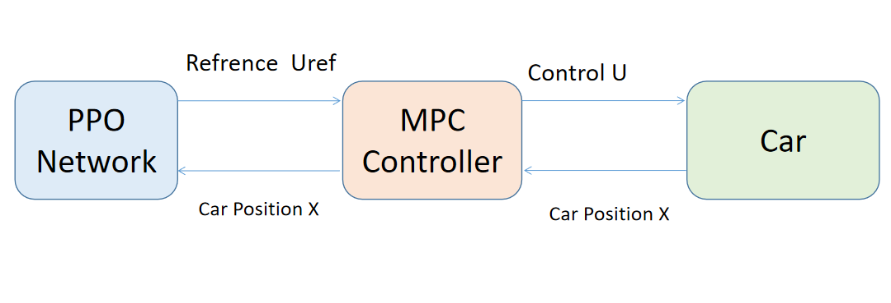
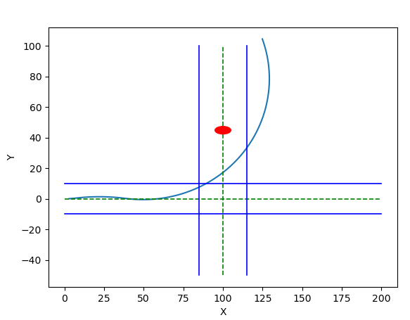

# README

# Introduction
In this project, we developed and simulated a new algorithm that combines model predictive control and deep reinforcement learning, to improve the safety and comfort of autonomous vehicles. At the same time, we tested the improved algorithm under three different autonomous driving scenarios, and compared it with the situation of using deep reinforcement learning alone and using model predictive control algorithm alone, proving the superiority of the fusion algorithm.


# Project structure
The project contains three files:
## Straightobs
The ego vehicle needs to drive along a straight line and avoid obstacles (including fixed obstacles and sudden pedestrians).

## Overtaking
ego vehicle needs to complete overtaking.


## Turnobs
The ego vehicle needs to turn and avoid oncoming vehicles.


# Code Introduction

Each folder contains the following files:

## MPC OUT.py 
This file is an MPC algorithm file. This file mainly includes the following contents:
#### shift Function
 The shift function calculates the next state of the vehicle using the given dynamics and control inputs. It also handles the obstacle avoidance constraint.

#### Define Parameters and Symbols
This section defines various parameters such as sampling interval (T), prediction horizon (N), vehicle and lane dimensions, and symbolic variables for the vehicle's state and control inputs.

#### Vehicle Dynamics
The code models the vehicle's dynamics using state-space equations. It computes matrices (AA, BB, CC) that represent the continuous-time linearized dynamics.

#### Define Cost Function
 The cost function is defined with weight matrices Q and R. It penalizes deviations from the reference trajectory and control inputs.

#### Define Optimization Variables
 The decision variables for optimization (U, P, X) are defined along with constraints.

#### MPC Optimization
 The code sets up an optimization problem using CasADi's nlpsol and solves it iteratively for each time step. It considers obstacle avoidance constraints and reference trajectories.

#### Simulation
 The code simulates the vehicle's trajectory and obstacle avoidance behavior. It updates the control inputs based on the optimization results and iterates through time steps.

#### Visualization
 The code includes visualization using matplotlib to plot the vehicle's trajectory, reference trajectory, and obstacle.


## MPC FUSION.py
This file is an MPC fusion algorithm file. In addition to the above-mentioned functions, the code also realizes the real-time communication function through the socket.

The code can be divided into the following main sections:

#### Socket Initialization
 Create a socket server to communicate with a client (not included in this code snippet).

#### shift Function
 Define the shift function, which computes the next state and control inputs based on the current state, controls, and the system dynamics.

#### Model Parameters
 Define the parameters of the vehicle model, including time step T, prediction horizon N, and various physical parameters.

#### State and Control Variables
 Define symbolic variables for states (Vx, Vy, x, y, theta, vtheta) and control inputs (ax, delta).

#### Vehicle Dynamics
 Define the vehicle dynamics using symbolic expressions for the state derivatives. The dynamics model is represented by matrices AA, BB, and CC.

#### Cost Function
 Define the cost function for MPC optimization, which includes state and control input weights (Q and R, respectively).

#### Constraints
 Set constraints on the state and control variables, including velocity limits, position limits, and control input limits.

#### Optimization Problem
 Set up the optimization problem using CasADi's NLP solver. Define the objective function, constraints, and initial conditions.

#### MPC Loop
 Implement the main MPC control loop, which iteratively solves the optimization problem and updates the control inputs.

#### Visualization
 Visualize the vehicle's trajectory, obstacles, and control inputs using Matplotlib.

<p align="center">

<br><br>
<b>Figure 1.</b> Fusion theory plot.
</p>


## PPO TRAIN.py
This file is used to train deep reinforcement learning neural network. 

The document uses the PPO algorithm to train an agent to control a vehicle in a simulated environment:

It defines an Actor-Critic neural network architecture for the agent, which is used to learn both the policy and the value function.

The agent interacts with the environment, collects experiences, and updates its policy using PPO.

The code contains hyperparameters that you can adjust to customize the training process.

During training, the code will print information about the training progress, including the rewards obtained by the agent.

<p align="center">

<br><br>
<b>Figure 2.</b> Actor critic theory plot.
</p>

## PPO TEST.py
The code can be divided into the following main sections:

#### Memory Class
The Memory class is defined to store information about actions, states, log probabilities, rewards, and whether the episode terminated. It is used to accumulate data for training the agent.

#### ActorCritic Class
 The ActorCritic class defines the actor-critic neural network architecture. The actor network outputs action probabilities for continuous actions, and the critic network estimates state values. This class also includes methods for action selection (act) and policy evaluation (evaluate).

#### PPO Class
 The PPO class encapsulates the PPO algorithm. It includes methods for selecting actions (select_action) and updating the policy using the PPO algorithm (update). It also handles loading a pretrained policy for evaluation purposes.

#### Visualization Function
 The myplot function is defined for plotting the vehicle's trajectory and obstacles during evaluation.

#### Main Function
 The main function contains the hyperparameters, training loop, and evaluation loop. It trains the agent to control the vehicle and evaluates the agent's performance in a simulated environment.


## PPO FUSION.py
The code can be divided into the following main sections:

### ActorCritic and PPO Classes
#### ActorCritic
 This class defines the actor-critic neural network model. It consists of an actor network for generating actions and a critic network for estimating state values.

#### PPO
 This class implements the Proximal Policy Optimization algorithm. It contains methods for selecting actions, updating the policy, and performing evaluations.

### Memory Class
#### Memory
 This class is responsible for storing and clearing the memory of the agent. It stores actions, states, log probabilities, rewards, and terminal flags.
### myplot Function
myplot(xground, yground): This function is responsible for creating a 2D plot of the vehicle's trajectory in the environment. It is used to visualize the agent's actions and the vehicle's path.
### main Function
main(): The main function orchestrates the training and testing of the reinforcement learning agent. It includes hyperparameters, environment setup, training loops, and testing loops. The agent learns to control the vehicle in the environment.


## ENV.py 
Run this file to see the test environment.

## Mydynamic.py
It contains the vehicle dynamics model, which can be called by other files.

In addition, each folder also contains the model files with the best training results so far for reference.


# Model Dependencies
## overall Dependencies
Python (>= 3.6)  
nvidia GPU

## MPC OUT.py Dependencies
CasADi (https://web.casadi.org/)  
numpy  
matplotlib  
imageio


## MPC FUSION.py Dependencies
CasADi  
numpy  
matplotlib  
imageio  
socket  
pickle 


## PPO TRAIN.py Dependencies
PyTorch (>= 1.0)    
numpy  
matplotlib  
mydynamic  


## PPO TEST.py Dependencies 
PyTorch (>= 1.0)    
numPy  
matplotlib


## PPO FUSION.py Dependencies
PyTorch (>= 1.0)   
numpy  
matplotlib  
math  
socket  
pickle  

The above dependencies can be installed through 
```bash
pip install models-you-need
```

# Useage

## Non-fused files
After configuring the environment and installing dependencies, you can run it directly in pycharm or use the following command.
For example if you run MPC OUT.py in turnobs file:
```bash
 cd .\final\turnobs\
python '.\MPC OUT.py'
```
The simulation result can be obtained which shows in img file(mpc turn.mp4) and the following is the screen shoot:

<p align="center">

<br><br>
<b>Figure 3.</b> screen shoot of the mpc turn.
</p>

In the simulation results, the blue rectangle represents the ego vehicle. The blue lines represent the road boundaries and the green dashed line represents the tracked path. The units of the x-axis and y-axis in the figure are meters[m].

And you can also train the PPO model use
```bash
 cd .\final\turnobs\
python '.\PPO TRAIN.py'
```
After training you can get the PPO_continuous_solved_{}.pth model

You can also test the model use
```bash
 cd .\final\turnobs\
python '.\PPO TEST.py'
```

## Fusion file
If it is a file with FUSION, you need to run PPO FUSION.py first, and then run MPC FUSION.py directly in pycharm or use the following command. 


```bash
 cd .\final\turnobs\
python '.\MPC FUSION.py'
```
open a new terminal:
```bash
 cd .\final\turnobs\
python '.\PPO FUSION.py'
```

After waiting for the two files to establish a connection through the socket, the simulation result can be obtained
which shows in img file(fusion turn.mp4) and the following is the screen shoot :


<p align="center">

<br><br>
<b>Figure 4.</b> Screen shoot of fusion turn.
</p>


In the simulation results, the blue rectangle represents the ego vehicle. The blue lines represent the road boundaries and the green dashed line represents the tracked path. The units of the x-axis and y-axis in the figure are meters[m].


# result
The video can be seen in img file. Following is the figure results.
In the simulation results, the blue rectangle represents the ego vehicle. The blue lines represent the road boundaries and the green dashed line represents the tracked path. The units of the x-axis and y-axis in the figure are meters[m].


## Obstacle avoidance
### PPO
<p align="center">

<br><br>
<b>Figure 5.</b> Straight obstacle avoiding results with PPO algorithm.
</p>

### MPC
<p align="center">

<br><br>
<b>Figure 6.</b> Straight obstacle avoiding results with mpc algorithm.
</p>

### fusion
<p align="center">

<br><br>
<b>Figure 7.</b> Straight obstacle avoiding results with fusion algorithm.
</p>


## Overtaking
### PPO
<p align="center">

<br><br>
<b>Figure 8.</b> Overtaking results with PPO algorithm.
</p>


### MPC
<p align="center">

<br><br>
<b>Figure 9.</b> Overtaking results with mpc algorithm.
</p>

### fusion
<p align="center">

<br><br>
<b>Figure 10.</b> Overtaking results with fusion algorithm.
</p>


## Turning and obstacle avoidance
### PPO
<p align="center">

<br><br>
<b>Figure 11.</b> Turn and avoid oncoming vehicles forecasting results with PPO algorithm.
</p>

### MPC
<p align="center">

<br><br>
<b>Figure 12.</b> Turn and avoid oncoming vehicles forecasting results with mpc algorithm.
</p>

### fusion
The fusion result shows as below
<p align="center">

<br><br>
<b>Figure 13.</b> Turn and avoid oncoming vehicles forecasting results with fusion algorithm.
</p>


# Author
Idea: Wenjun Liu  
Code writing: Ziting Huang  

2023/9/8


